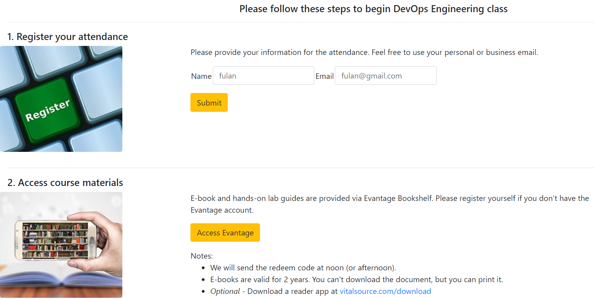

## Python Flask on AWS
_Aplikasi website menggunakan python dan framework Flask yang dipackage kedalam docker image. Aplikasi dibuild menggunakan service AWS CodeBuild dan statusnya bisa dilihat menggunakan badgenya_

