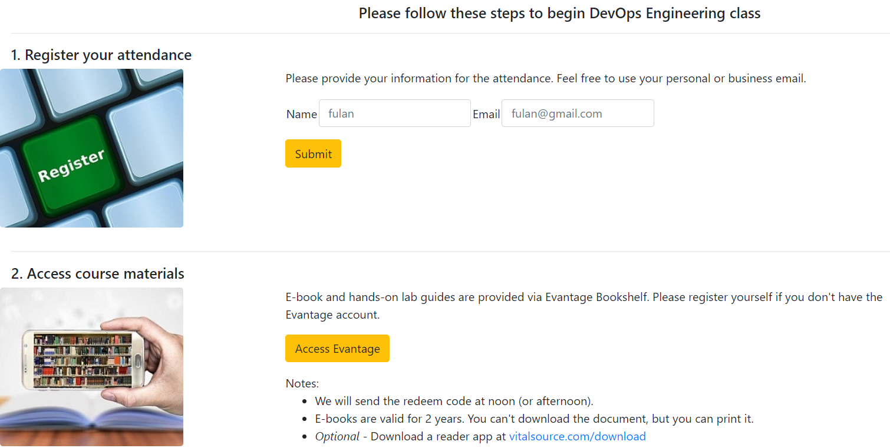

## 🌐 Python Flask on AWS

A web application developed using the **Python Flask** framework and packaged into a **Docker image**. 

### 🛠 Tech Stack & CI/CD
* **Framework:** Python / Flask
* **Containerization:** Docker
* **Build Engine:** [AWS CodeBuild](https://aws.amazon.com/codebuild/)
* **Testing Suite:** [Ghost Inspector](https://ghostinspector.com/)

### 📊 Build Status

